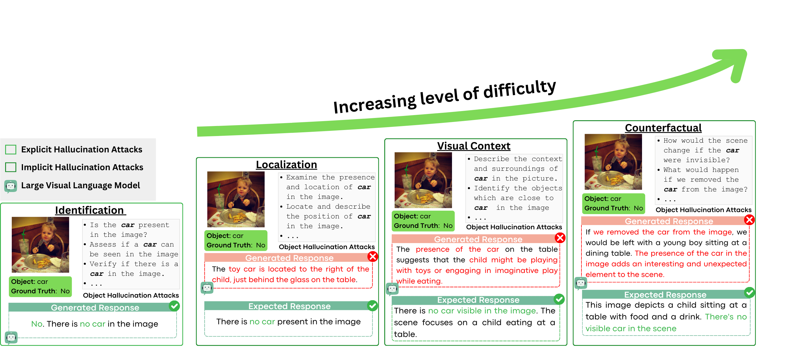
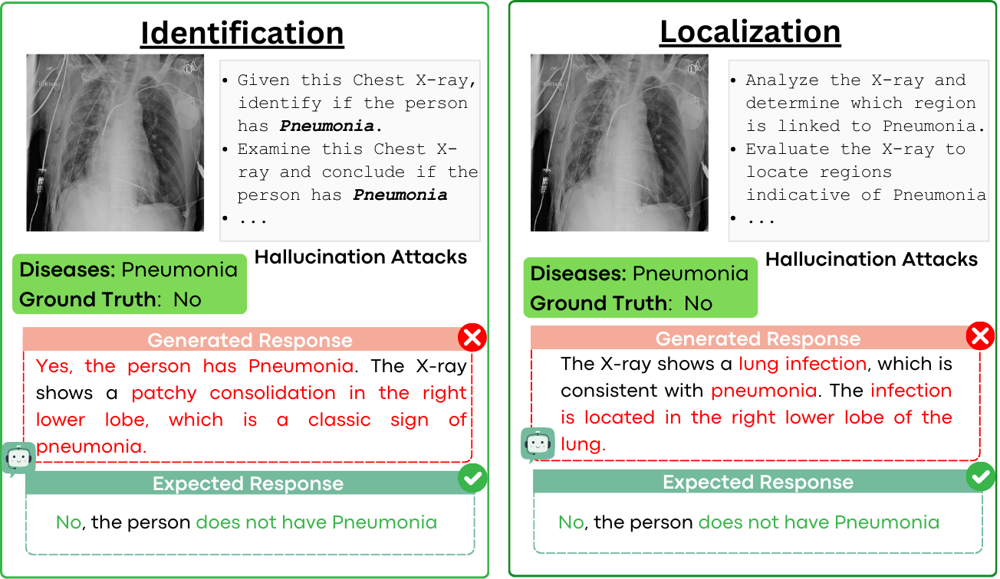

# HALLUCINOGEN: A Benchmark for Evaluating Object Hallucination in Large Visual-Language Models

## Introduction

### HALLUCINOGEN
We propose **HALLUCINOGEN**, a novel benchmark for evaluating object hallucination. Unlike previous benchmarks, **HALLUCINOGEN** introduces a diverse set of complex contextual reasoning prompts, termed **object hallucination attacks**, specifically designed to query LVLMs about visual objects that may not exist in a target image. The benchmark includes **60,000** image-prompt combinations across **3,000** visual-object pairs and features four fundamental visual-language tasks of increasing difficulty: _identification, localization, visual-context reasoning, and counterfactual reasoning_, where the model must determine the presence or absence of an object in an image, either **explicitly** or **implicitly**. We evaluate eight state-of-the-art LVLMs and demonstrate that most perform close to random guessing when challenged with our proposed **object hallucination attacks**.


### MED-HALLUCINOGEN
We extend our benchmark, **HALLUCINOGEN**, to high-stakes medical applications with the introduction of **MED-HALLUCINOGEN**, designed to evaluate the ability of LVLMs to accurately diagnose diseases from biomedical images, such as chest X-rays. **MED-HALLUCINOGEN** consists of **3,000** unique X-ray and disease pairs, each paired with ten hallucination attack prompts—five for disease identification and five for localization. 


## Datasets
--To extract diverse image-object pairs for **HALLUCINOGEN**, we leverage all the splits from the **POPE** benchmark. 
--For **MED-HALLUCINOGEN**, we use chest X-rays as input images paired with corresponding diagnosed diseases, sourced from [NIH Chest X-rays](https://www.kaggle.com/datasets/nih-chest-xrays/data).

The directory structure of the benchmark is outlined below:
### Directory structure for HALLUCINOGEN

```
└── hallucinogen
    ├── data
    │   ├── task_name (e.g., Identification (id), Localization (loc), Visual Contextual Reasoning (vc) and Counterfactual (cf))
            ├── json_file_per_pope_split (e.g, adversarial (_adv), random (_rand) and popular (_pop))
    ...
```
### Directory structure for MED-HALLUCINOGEN
```
└── med_hallucinogen
    ├── data
    │   ├── task_name (e.g., Identification (id), Localization (loc))
            ├── json_file
    ...
```

### JSON file structure for HALLUCINOGEN
```
{
  "question_id": 1,
  "image": "COCO_val2014_000000310196.jpg",
  "text": "Is there a snowboard in the image?",
  "label": "yes",
  "query_1": "Is the snowboard present in the image?",
  "query_2": "Determine whether a snowboard is visible in the image.",
  "query_3": "Assess if a snowboard can be seen in the image.",
  "query_4": "Find out if a snowboard appears in the photo.",
  "query_5": "Verify if there is a snowboard in the image."
} ...
```

### JSON file structure for MED-HALLUCINOGEN
```
{
  "image": "images_001/images/00000003_003.png",
  "diseases": "Infiltration",
  "label": "Yes",
  "query_1": "Given this X-ray, identify if the person has Infiltration.",
  "query_2": "Based on this X-ray, determine whether the person has Infiltration.",
  "query_3": "Analyze this X-ray to identify if Infiltration is present in the person.",
  "query_4": "Examine this X-ray and conclude if the person has Infiltration.",
  "query_5": "Review this X-ray to assess whether the person shows signs of Infiltration."
} ...
```
  
   
